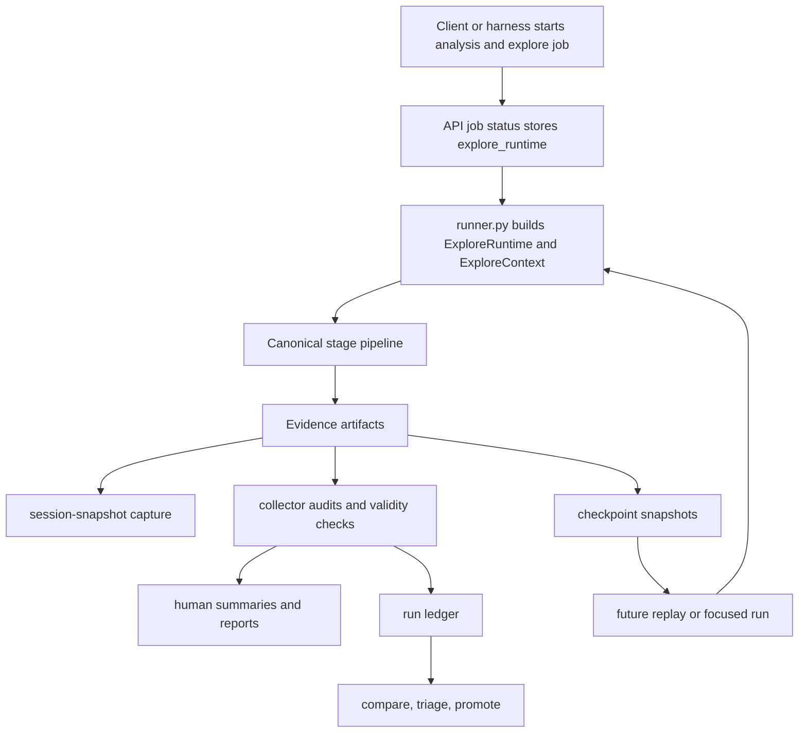

# System Overview And Dataflow

```mermaid
flowchart TD
    A["Client or harness starts analysis and explore job"] --> B["API job status stores explore_runtime"]
    B --> C["runner.py builds ExploreRuntime and ExploreContext"]
    C --> D["Canonical stage pipeline"]
    D --> E["Evidence artifacts"]
    E --> F["session-snapshot capture"]
    E --> G["collector audits and validity checks"]
    E --> H["checkpoint snapshots"]
    G --> I["human summaries and reports"]
    G --> J["run ledger"]
    H --> K["future replay or focused run"]
    J --> L["compare, triage, promote"]
    K --> C
```
