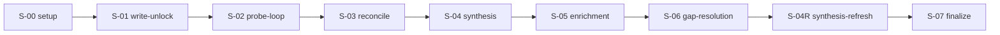

# Stage Model

```mermaid
flowchart LR
    S00["S-00 setup"] --> S01["S-01 write-unlock"] --> S02["S-02 probe-loop"] --> S03["S-03 reconcile"] --> S04["S-04 synthesis"] --> S05["S-05 enrichment"] --> S06["S-06 gap-resolution"] --> S04R["S-04R synthesis-refresh"] --> S07["S-07 finalize"]
```
