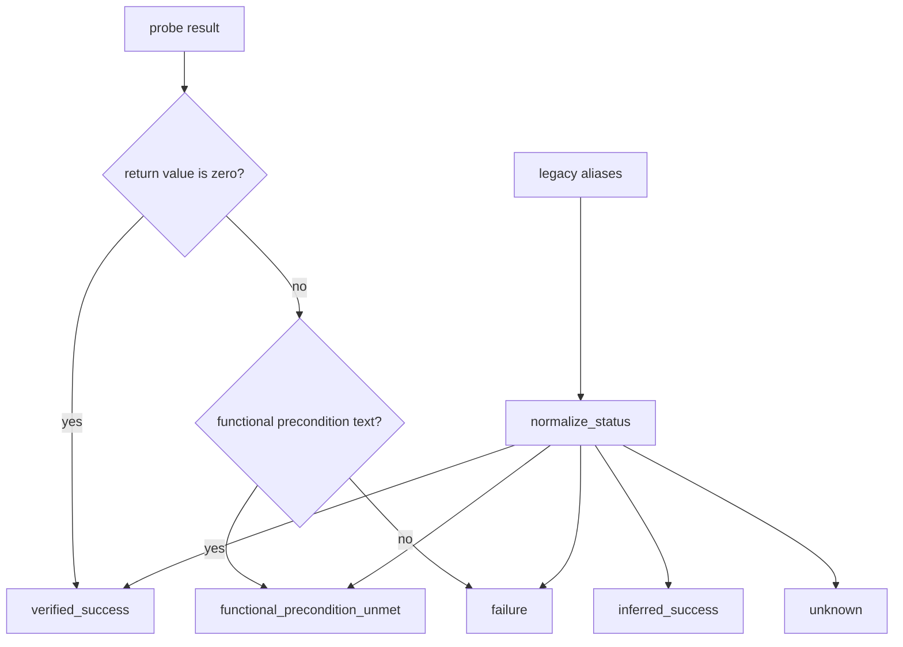

# Status And Classification

```mermaid
flowchart TD
    A["probe result"] --> B{"return value is zero?"}
    B -- "yes" --> VS["verified_success"]
    B -- "no" --> C{"functional precondition text?"}
    C -- "yes" --> FP["functional_precondition_unmet"]
    C -- "no" --> F["failure"]
    N["legacy aliases"] --> U["normalize_status"] --> VS
    U --> FP
    U --> IS["inferred_success"]
    U --> F
    U --> UNK["unknown"]
```
