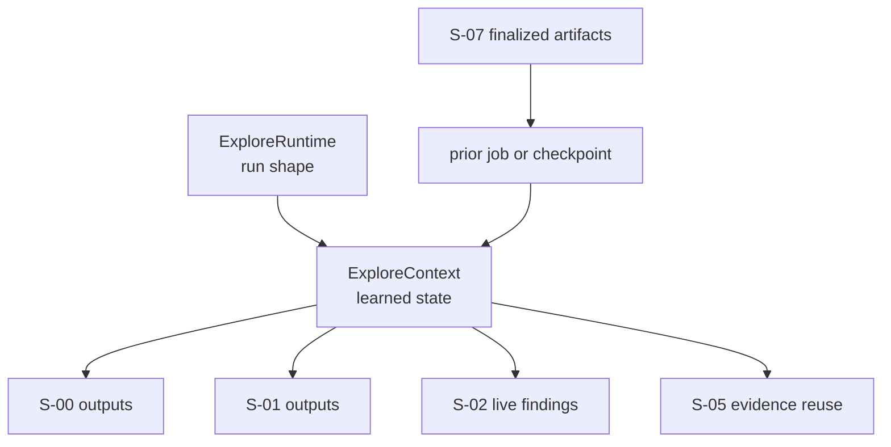

# Context And Memory Model

```mermaid
flowchart TD
    R["ExploreRuntime<br/>run shape"] --> C["ExploreContext<br/>learned state"]
    P["prior job or checkpoint"] --> C
    C --> S00["S-00 outputs"]
    C --> S01["S-01 outputs"]
    C --> S02["S-02 live findings"]
    C --> S05["S-05 evidence reuse"]
    S07["S-07 finalized artifacts"] --> P
```
