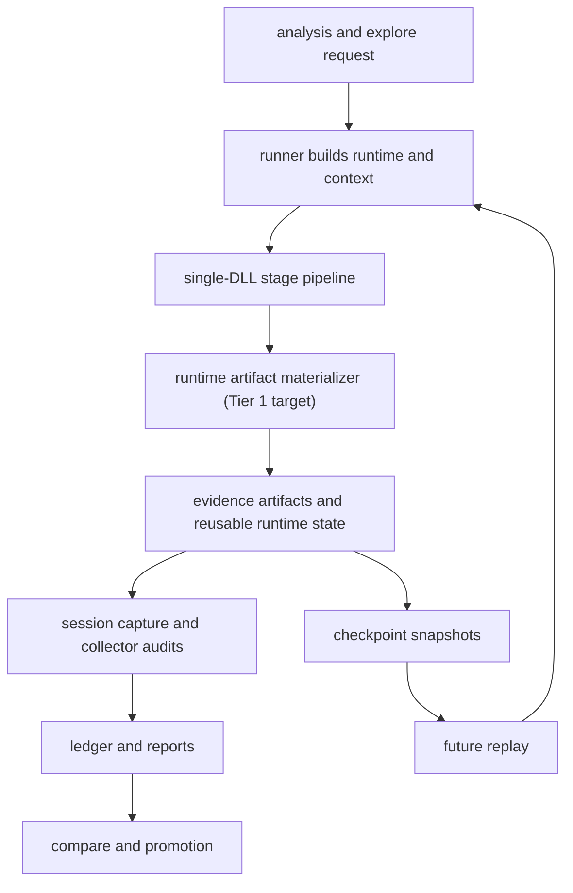

# System Overview And Dataflow

```mermaid
flowchart TD
    A["analysis and explore request"] --> B["runner builds runtime and context"]
    B --> C["single-DLL stage pipeline"]
    C --> D["runtime artifact materializer (Tier 1 target)"]
    D --> E["evidence artifacts and reusable runtime state"]
    E --> F["session capture and collector audits"]
    E --> G["checkpoint snapshots"]
    F --> H["ledger and reports"]
    G --> I["future replay"]
    H --> J["compare and promotion"]
    I --> B
```

Current first-wave result:

- useful but incomplete
- helped chain-heavy and reporting surfaces
- did not yet unlock the transport hard-tier surface
