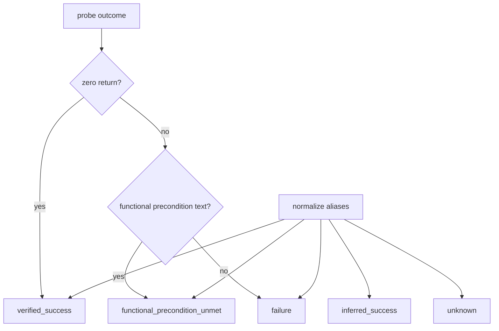

# Status And Classification

```mermaid
flowchart TD
    A["probe outcome"] --> B{"zero return?"}
    B -- "yes" --> VS["verified_success"]
    B -- "no" --> C{"functional precondition text?"}
    C -- "yes" --> FP["functional_precondition_unmet"]
    C -- "no" --> F["failure"]
    N["normalize aliases"] --> VS
    N --> FP
    N --> IS["inferred_success"]
    N --> F
    N --> U["unknown"]
```
